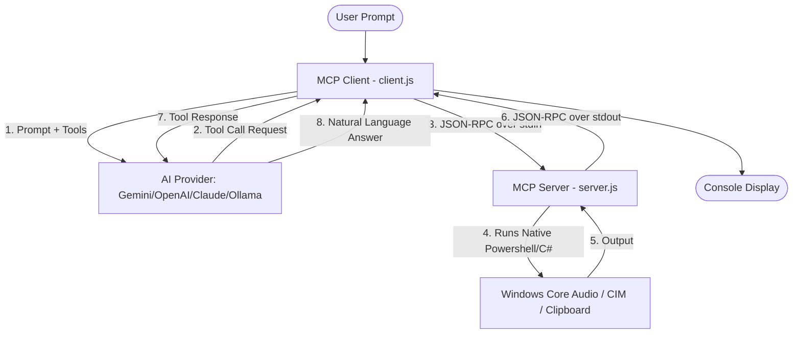

# System & Media Control MCP Client/Server (Windows)

A Node.js-based Model Context Protocol (MCP) automation system that enables Artificial Intelligence (Google Gemini, OpenAI, Anthropic Claude, or Local AI models like Ollama/LM Studio) to query and control your Windows PC using natural language.

---

## 📖 Table of Contents
1. [Features](#-features)
2. [How It Works](#-how-it-works)
3. [Prerequisites](#-prerequisites)
4. [Installation & Setup](#-installation--setup)
5. [Configuration](#%EF%B8%8F-configuration)
6. [Usage](#-usage)
7. [Available Tools (29 total)](#-available-tools-29-total)

---

## 🌟 Features

### 💻 System & Resource Monitoring
* **get_system_status**: CPU load, RAM usage, primary disk (C:) free capacity, and system uptime.
* **get_system_info**: Retrieve detailed static system hardware specifications (CPU, motherboard, RAM slots, OS, BIOS).
* **get_disk_space**: Returns storage space metrics (total, used, free) for all active system drives.
* **get_top_processes**: Top 5 CPU-intensive running processes with PIDs and CPU percentages.
* **get_battery_status**: Battery health percentage, charging state, and estimated remaining minutes (laptops).
* **get_network_info**: Retrieves local IPv4 addresses, active network adapters, and external IP.
* **get_dns_servers**: Retrieves configured DNS server IP addresses for the active network interfaces.
* **get_network_latency**: Test latency (ping response time) to major targets (e.g. google.com).
* **get_wifi_networks**: Scans and lists nearby Wi-Fi network SSIDs and signal strengths.
* **get_wifi_status**: Retrieves status details of the currently active Wi-Fi connection (SSID, Signal quality, Transmission rate).
* **get_active_window**: Retrieves the title, process name, and PID of the currently active focused foreground window.
* **get_gpu_info**: GPU graphics card details, driver versions, and VRAM memory.
* **get_audio_devices**: Lists available system output and input audio hardware controllers.

### 🎛 PC & Media Control
* **media_control**: Simulates keyboard media keys (Play/Pause, Next Track, Previous Track, Stop).
* **get_volume / set_volume / set_mute**: Checks system volume level, sets level (0-100), and mutes/unmutes audio.
* **get_brightness / set_brightness**: Reads or changes monitor brightness (0-100%).
* **system_power_control**: Locks the screen, puts the PC to sleep, schedules a shutdown/restart (with a 60s warning), or aborts active power schedules.
* **close_process**: Force terminates a running background/foreground process by name or process ID.

### 📋 Automation & Clipboard Utilities
* **get_clipboard**: Reads text contents currently on the Windows clipboard.
* **set_clipboard**: Copies a text string to the system clipboard.
* **clear_clipboard**: Clears all text contents currently on the Windows clipboard.
* **open_url**: Launches a website URL in the default web browser.
* **launch_app**: Spawns a desktop application by command name (e.g. `notepad`, `calc`, `explorer`).
* **take_screenshot**: Captures a PNG screenshot of the primary screen and saves it locally.
* **empty_recycle_bin**: Empties the Windows Recycle Bin.
* **show_desktop**: Minimizes all active GUI windows instantly.

---

## ⚙️ How It Works



1. **Background Spawn**: The client runs as a Node.js process and spawns the MCP server as a background process (`child_process.spawn`).
2. **JSON-RPC handshake**: During startup, they perform a line-by-line handshake over `stdin` and `stdout` using JSON-RPC 2.0.
3. **AI routing**: The client prompts your chosen AI provider with the user prompt and the server's tools list.
4. **Tool Call Interception**: When the AI responds with a Tool Call request, the client intercepts it, translates it to a `tools/call` JSON-RPC message, and forwards it to the server's `stdin`.
5. **Windows Integration**: The server runs native PowerShell command scripts, compiling on-the-fly C# interfaces to bypass the COM binder inside PowerShell, interacting directly with core APIs and user32 keyboard emulation.
6. **Result Loop**: The tool result is returned over `stdout` to the client, which feeds it back to the AI. The AI then formulates a final user response.
7. **Interactive loop**: When executed without argument, the client enters a continuous loop where you can chat with the PC Agent.

---

## 💻 Prerequisites
* **Operating System**: Windows (required for CIM, user32, and COM audio objects).
* **Runtime**: Node.js v18 or higher.

---

## 📦 Installation & Setup

1. Clone this repository:
   ```bash
   git clone https://github.com/noackjona-hash/system-media-control-mcp.git
   cd system-media-control-mcp
   ```

2. Install npm packages:
   ```bash
   npm install
   ```

---

## ⚙️ Configuration

Create a file named `.env` in the root folder (automatically ignored by git) and set your preferred AI provider:

```env
# Choose AI Provider: gemini, openai, anthropic, groq, github, deepseek, mistral, together, openrouter, watsonx, perplexity, nvidia, local, mock, etc.
AI_PROVIDER=gemini

# Google Gemini API
GEMINI_API_KEY=AIzaSy...
GEMINI_MODEL=gemini-2.5-flash

# OpenAI API
OPENAI_API_KEY=sk-...
OPENAI_MODEL=gpt-4o-mini

# Anthropic Claude API
ANTHROPIC_API_KEY=sk-ant-...
ANTHROPIC_MODEL=claude-3-5-sonnet-20241022

# Groq AI API
GROQ_API_KEY=gsk_...
GROQ_MODEL=llama-3.3-70b-versatile

# GitHub Models API
GITHUB_TOKEN=ghp_...
GITHUB_MODEL=gpt-4o

# Other supported providers (DeepSeek, Mistral, Together, OpenRouter, Watsonx, Perplexity, Cloudflare, Nebius, NVIDIA NIM, Upstage, Moonshot, etc.)
DEEPSEEK_API_KEY=sk-...
MISTRAL_API_KEY=sk-...
PERPLEXITY_API_KEY=pplx-...

# Local AI / Ollama / LM Studio (OpenAI-compatible)
LOCAL_API_BASE=http://localhost:11434/v1
LOCAL_MODEL=llama3.2:1b
```
*(If no API keys are found or configured, it defaults to **Mock Mode**, running keyword analysis locally to simulate tool execution. Perfect for offline testing!)*

---

## 🚀 Usage

### Continuous Interactive Chat Loop (Recommended)
Run the client with no arguments to start a persistent shell session:
```bash
npm start
```
You can chat continuously:
```text
Ask PC Agent > How busy is my PC?
Ask PC Agent > Open github.com
Ask PC Agent > Mute the volume
Ask PC Agent > exit
```

### CLI Command Mode (Single-Shot)
Pass your instruction directly as a command-line argument:
```bash
npm start "Show my desktop"
npm start "Copy 'Antigravity' to my clipboard"
npm start "Check the battery status"
```

---

## 🛠 Available Tools

| Tool Name | Parameters | Description |
| :--- | :--- | :--- |
| `get_system_status` | None | Returns CPU load, RAM usage (GB/%), C: disk space, and uptime. |
| `get_top_processes` | None | Returns the top 5 CPU consuming active processes. |
| `get_battery_status`| None | Returns charge level (%), charging status, and remaining time. |
| `get_brightness` | None | Gets current screen brightness percentage. |
| `set_brightness` | `level` (0-100) | Sets screen brightness to the specified level. |
| `get_volume` | None | Gets master volume (0-100) and mute status. |
| `set_volume` | `level` (0-100) | Sets master volume level. |
| `set_mute` | `mute` (boolean)| Mutes or unmutes system audio. |
| `media_control` | `action` (string)| Simulates keypress: `play_pause`, `next_track`, `prev_track`, `stop`. |
| `system_power_control`| `action` (string)| Performs power action: `lock`, `sleep`, `shutdown`, `restart`, `abort_shutdown`. |
| `get_clipboard` | None | Returns text content on the Windows clipboard. |
| `set_clipboard` | `text` (string) | Copies the text to the Windows clipboard. |
| `open_url` | `url` (string) | Opens the URL in the default browser. |
| `launch_app` | `app` (string) | Launches the application (e.g. `notepad`). |
| `get_network_info` | None | Returns local IPs, network adapter name, external IP, and SSID. |
| `show_desktop` | None | Minimizes all active windows to show the desktop. |
| `get_gpu_info` | None | Returns GPU name, driver version, memory, and status. |
| `get_audio_devices`| None | Lists all active audio output and input devices. |
| `close_process` | `target` (string) | Force closes process by name or PID. |
| `empty_recycle_bin`| None | Empties the Windows Recycle Bin. |
| `get_disk_space`   | None | Gets storage metrics (total, used, free) for all active drives. |
| `take_screenshot`  | `filename` (string) | Captures primary display screenshot and saves it locally. |
| `get_wifi_networks`| None | Scans and lists nearby Wi-Fi network SSIDs and signal strengths. |
| `get_system_info`  | None | Retrieves static system specs (Motherboard, CPU, RAM modules info). |
| `get_wifi_status`  | None | Retrieves details of current Wi-Fi SSID, rate, and signal quality. |
| `get_network_latency`| `target` (string) | Tests latency (ping response time) to custom or default addresses. |
| `clear_clipboard`  | None | Clears all text contents currently on the Windows clipboard. |
| `get_dns_servers`  | None | Retrieves configured DNS server IP addresses for the network interface. |
| `get_active_window`| None | Retrieves the title, process name, and PID of the focused foreground window. |
