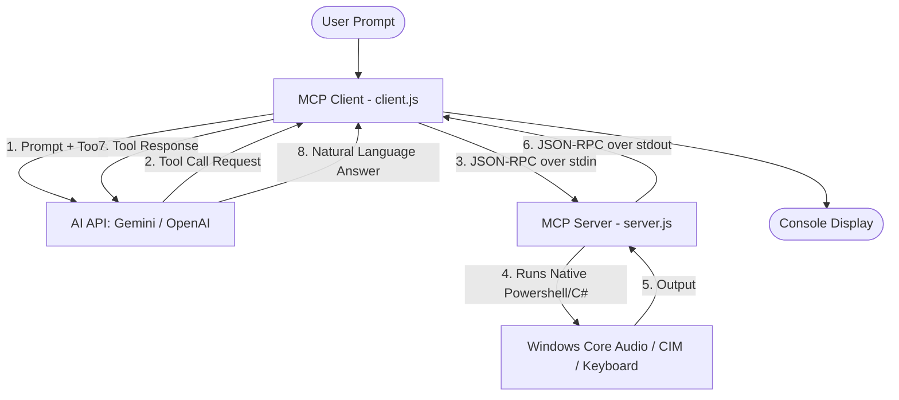

# System & Media Control MCP Client/Server (Windows)

Ein Node.js-basiertes Model Context Protocol (MCP) System, mit dem eine Künstliche Intelligenz (wie Google Gemini oder OpenAI) Ihren Windows-PC per natürlicher Sprache steuern und abfragen kann.

A Node.js-based Model Context Protocol (MCP) setup that allows an AI (like Google Gemini or OpenAI) to control and query your Windows PC using natural language.

---

## 📖 Inhaltsverzeichnis / Table of Contents
1. [Features](#-features)
2. [Funktionsweise / How It Works](#-funktionsweise--how-it-works)
3. [Systemvoraussetzungen / Prerequisites](#-systemvoraussetzungen--prerequisites)
4. [Installation & Setup](#-installation--setup)
5. [Konfiguration / Configuration](#%EF%B8%8F-konfiguration--configuration)
6. [Nutzung / Usage](#-nutzung--usage)
7. [Verfügbare Tools / Available Tools](#-verf%C3%BCgbare-tools--available-tools)

---

## 🌟 Features

### System- & Hardware-Abfragen (System & Hardware Queries)
* **get_system_status**: CPU-Auslastung, RAM-Verbrauch (GB & %), freier Festplattenspeicher (C:) & System-Uptime.
* **get_top_processes**: Top 5 ressourcenhungrige Prozesse (instantane CPU-Auslastung).
* **get_battery_status**: Akkustand, Ladestatus und verbleibende Laufzeit (für Laptops).
* **get_brightness**: Aktuelle Bildschirmhelligkeit.

### PC- & Mediensteuerung (PC & Media Control)
* **set_brightness**: Bildschirmhelligkeit anpassen (0-100%).
* **get_volume / set_volume / set_mute**: Lautstärke abfragen, auf bestimmten Wert setzen oder stumm-/lautschalten.
* **media_control**: Musik abspielen/pausieren, nächsten/vorherigen Titel abspielen oder stoppen (simuliert globale Tastatur-Medientasten).
* **system_power_control**: PC sperren, in den Ruhezustand (Sleep) versetzen, zeitgesteuert herunterfahren/neu starten (in 60s) oder diese Aktionen abbrechen.

---

## ⚙️ Funktionsweise / How It Works



1. **Background Process**: Der Client startet den Server im Hintergrund als Child-Process (`child_process.spawn`).
2. **JSON-RPC Handshake**: Beim Start wird eine Verbindung aufgebaut und initialisiert (`initialize` und `tools/list`).
3. **AI integration**: Der Client sendet die Benutzerfrage an die Gemini- oder OpenAI-API und übergibt die Liste der Tools.
4. **Tool Call & Execution**: Die KI entscheidet, welche Funktion sie benötigt, und gibt einen "Tool Call" zurück. Der Client fängt diesen ab, parst ihn und leitet ihn eins zu eins via `stdin` als JSON-RPC an den Server weiter.
5. **Windows Integration**: Der Server führt ein Windows-native PowerShell-Skript aus, welches wiederum eine dynamisch kompilierte C#-Klasse nutzt, um direkt auf Windows Core Audio APIs, CIM/WMI-Schnittstellen und das User32-Keyboard zuzugreifen.
6. **Response Cycle**: Das Ergebnis wird über `stdout` an den Client zurückgeschickt, der es an die KI weiterleitet, damit diese die finale Antwort für den Benutzer formulieren kann.
7. **Interactive Loop**: Wird der Client ohne Befehlszeilenparameter aufgerufen, startet er einen interaktiven Loop, in dem Sie durchgehend Fragen stellen können, ohne das Programm jedes Mal neu starten zu müssen.

---

## 💻 Systemvoraussetzungen / Prerequisites
* **Betriebssystem**: Windows (erforderlich für Core Audio COM, CIM und User32 APIs).
* **Runtime**: Node.js v18 oder höher.

---

## 📦 Installation & Setup

1. Repository klonen / Clone this repository:
   ```bash
   git clone https://github.com/noackjona-hash/system-media-control-mcp.git
   cd system-media-control-mcp
   ```

2. Abhängigkeiten installieren / Install dependencies:
   ```bash
   npm install
   ```

---

## ⚙️ Konfiguration / Configuration

Erstellen Sie eine Datei namens `.env` im Hauptverzeichnis (wird automatisch von Git ignoriert) und tragen Sie Ihren API-Schlüssel ein:
Create a `.env` file in the root directory (automatically ignored by Git) and enter your API key:

```env
GEMINI_API_KEY=Ihr_Gemini_API_Schluessel_Hier
# ODER / OR
OPENAI_API_KEY=Ihr_OpenAI_API_Schluessel_Hier
```
*(Hinweis: Wenn kein Schlüssel konfiguriert ist, startet das Programm im **Mock AI Mode**, der lokal analysiert, welches Tool aufgerufen werden soll. Perfekt zum Testen ohne Internet/Kosten!)*
*(Note: If no key is set, the client starts in **Mock AI Mode**, simulating tool calls locally. Great for offline testing!)*

---

## 🚀 Nutzung / Usage

### Interaktiver Chat-Modus / Interactive Loop (Empfohlen / Recommended)
Starten Sie den Agenten-Prompt, um fortlaufend Befehle einzugeben:
Start the agent prompt to enter multiple queries sequentially:
```bash
npm start
```

### Einmaliger Befehl / CLI Mode (Single-Shot)
Übergeben Sie Ihre Frage direkt als Argument auf der Befehlszeile:
Pass your query directly as a CLI argument:
```bash
npm start "Wie ausgelastet ist mein PC?"
npm start "Stelle die Lautstärke auf 40 Prozent"
npm start "Pausiere meine Musik"
```

---

## 🛠 Verfügbare Tools / Available Tools

### 1. `get_system_status`
* **Beschreibung**: Ermittelt CPU-Last, RAM-Verbrauch (Gesamt, Verwendet, Frei, %), primäre Festplattenkapazität (C:) und Systemuptime.
* **Arguments**: Keine / None

### 2. `get_top_processes`
* **Beschreibung**: Liefert die Top 5 Prozesse, die die meiste CPU-Last beanspruchen (instantane Auslastung).
* **Arguments**: Keine / None

### 3. `get_battery_status`
* **Beschreibung**: Gibt den Ladestand (%), Status (Laden, Entladen, AC) und verbleibende Minuten an.
* **Arguments**: Keine / None

### 4. `get_brightness` & `set_brightness`
* **Beschreibung**: Liest die aktuelle Helligkeit aus oder setzt sie auf einen bestimmten Wert.
* **Arguments (`set_brightness`)**: `level` (Number, 0-100)

### 5. `get_volume` & `set_volume` & `set_mute`
* **Beschreibung**: Liest die Master-Systemlautstärke aus, setzt sie oder schaltet den Ton stumm/laut.
* **Arguments (`set_volume`)**: `level` (Number, 0-100)
* **Arguments (`set_mute`)**: `mute` (Boolean)

### 6. `media_control`
* **Beschreibung**: Simuliert Tastendrücke für globale Wiedergabesteuerung.
* **Arguments**: `action` (String Enum: `"play_pause"`, `"next_track"`, `"prev_track"`, `"stop"`)

### 7. `system_power_control`
* **Beschreibung**: Führt Energiespar- oder Ausschaltaktionen durch.
* **Arguments**: `action` (String Enum: `"lock"`, `"sleep"`, `"shutdown"`, `"restart"`, `"abort_shutdown"`)
